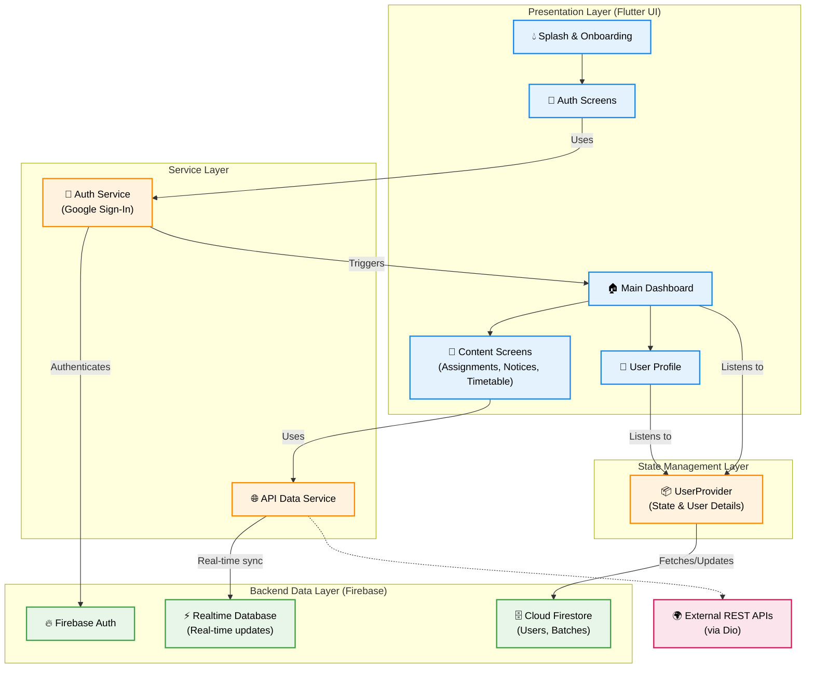

# 🎓 Batch-Mate


Batch-Mate is a comprehensive classroom and batch management application built with **Flutter** and powered by **Firebase**. It provides an intuitive platform for students and educators to stay synced with their daily schedules, assignments, and important notices. 

Whether you need to check your timetable, track upcoming assignment deadlines, or get the latest class announcements, Batch-Mate provides a centralized hub to keep you organized.

---

## ✨ Key Features

- **🔒 Secure Authentication**: Seamless and secure Google Sign-In using Firebase Authentication.
- **🏠 Smart Dashboard**: A beautifully designed home screen providing a quick overview of the latest assignments, timetables, and important notices.
- **📚 Assignment Tracking**: Add, view, edit, and delete assignments. Keep track of subjects, descriptions, and crucial due dates.
- **📅 Timetable Management**: Stay on top of your classes. Add and view daily or weekly timetables, detailing subjects, rooms, and specific timings.
- **📢 Notice Board**: Broadcast and view important announcements and notices for the entire batch in real-time.
- **👤 User Profiles**: Manage personal details, batch IDs, and custom display names synchronized via Cloud Firestore.
- **🚀 Smooth Onboarding**: An intuitive onboarding flow for first-time users to get acquainted with the application's capabilities.
- **✨ Polished UI/UX**: Includes features like Shimmer effects (`shimmer_text`, `skeletonizer`) for smooth loading states and `animated_text_kit` for beautiful text reveals.

---

## 🏗️ Architecture & App Flow

The application follows a modular and scalable architecture. It separates the UI presentation layer from the business logic and state management using the **Provider** pattern, while data is synchronized in real-time with Firebase.



---

## 📂 Project Structure

```text
lib/
├── Animation/           # Custom UI animations and transitions
├── Provider/            # State management (e.g., userProvider.dart)
├── Screens/             # Core UI presentation layer
│   ├── On-Boarding Screen/ # App intro and setup
│   ├── Services/        # Backend connectors (Auth, APIs)
│   ├── User Profile/    # Profile management UI
│   ├── contentScreens/  # Feature modules (Assignment, Notice, Timetable)
│   ├── main_Screen.dart # Dashboard shell & navigation
│   └── splash_Screen.dart # Initial launch screen
├── components/          # Reusable structural widgets
├── customs/             # Custom built widgets (e.g., textField.dart)
├── firebase_options.dart # Firebase initialization configuration
└── main.dart            # Application entry point
```

---

## 🛠️ Tech Stack & Dependencies

- **Framework**: Flutter (SDK ^3.8.1)
- **Language**: Dart
- **State Management**: `provider` (^6.1.5)
- **Backend & Services**: 
  - `firebase_core`, `firebase_auth`, `cloud_firestore`, `firebase_analytics`
  - `google_sign_in` (OAuth 2.0 Integration)
- **Networking**: `dio` (^5.9.0) for external API communication.
- **UI Enhancements**: 
  - `skeletonizer` & `shimmer_text` (Loading placeholders)
  - `animated_text_kit` & `smooth_page_indicator`
  - `font_awesome_flutter` & `cupertino_icons`

---

## 🚀 Getting Started

To get a local copy up and running, follow these simple steps.

### Prerequisites

- Install the [Flutter SDK](https://flutter.dev/docs/get-started/install).
- A Firebase project configured for Android, iOS, or Web.
- Visual Studio Code or Android Studio with Flutter extensions.

### Installation

1. **Clone the repository**
   ```sh
   git clone https://github.com/your-username/batch-mate.git
   cd batch-mate
   ```

2. **Install Flutter packages**
   ```sh
   flutter pub get
   ```

3. **Configure Firebase**
   - Ensure you have the Firebase CLI installed (`npm install -g firebase-tools`).
   - Run `flutterfire configure` to generate/update the `lib/firebase_options.dart` file based on your Firebase project.

4. **Run the App**
   ```sh
   flutter run
   ```

---

## 🛡️ License

Distributed under the MIT License. See `LICENSE` for more information.
